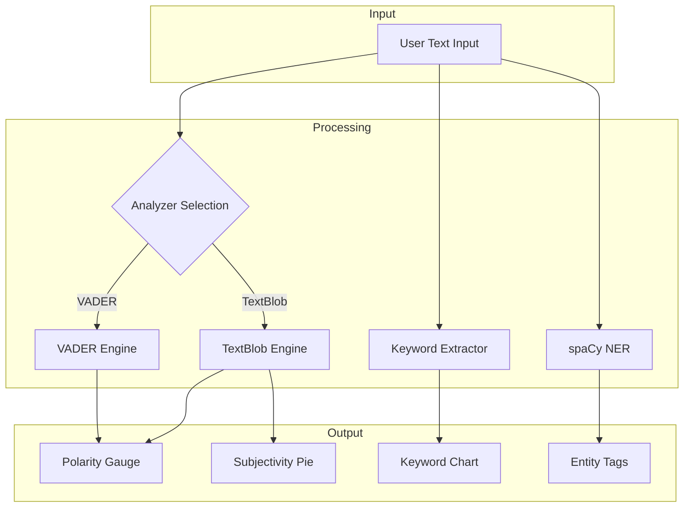

# Sentiment Dynamics

[](https://elliottfairhall-interactive-sentiment-analysis-main-62u54w.streamlit.app/)
[](https://www.python.org/downloads/)
[](https://opensource.org/licenses/MIT)
[](https://github.com/astral-sh/ruff)

An interactive sentiment analysis dashboard that transforms text into actionable insights using Natural Language
Processing (NLP) and pre-trained machine learning models.

## Features

- **Dual Sentiment Engines**: Choose between TextBlob and VADER analysers
- **Polarity Scoring**: Measure emotional lean from -1 (negative) to +1 (positive)
- **Subjectivity Analysis**: Quantify factual vs opinionated content (TextBlob only)
- **Keyword Extraction**: Identify the most frequent thematic anchors
- **Named Entity Recognition**: Classify people, organisations, locations, and dates
- **Premium UI**: Glassmorphism aesthetic with responsive Plotly visualisations

## Architecture



## Project Structure

```
Interactive-Sentiment-Analysis/
├── app.py                    # Main Streamlit application
├── pyproject.toml            # Project configuration and dependencies
├── requirements.txt          # Production dependencies
├── .pre-commit-config.yaml   # Pre-commit hooks configuration
├── .streamlit/
│   └── config.toml           # Streamlit theme configuration
├── assets/
│   └── images/
│       └── Scentiment.jpg    # Hero image
├── styles/
│   └── main.css              # Custom CSS styling
├── utils/
│   ├── __init__.py           # Package exports
│   ├── analytics.py          # NLP analysis functions
│   ├── plots.py              # Plotly visualisation functions
│   └── text.py               # UI content and documentation
└── tests/
    ├── __init__.py
    ├── test_analytics.py     # Analytics module tests
    └── test_plots.py         # Plots module tests
```

## Requirements

| Package        | Version  | Purpose                                      |
| -------------- | -------- | -------------------------------------------- |
| Python         | >=3.10   | Runtime environment                          |
| Streamlit      | >=1.32.0 | Web application framework                    |
| TextBlob       | >=0.17.0 | Sentiment analysis (polarity + subjectivity) |
| vaderSentiment | >=3.3.0  | Social media sentiment analysis              |
| spaCy          | >=3.7.0  | Named entity recognition                     |
| NLTK           | >=3.8.0  | Stopwords for keyword extraction             |
| Plotly         | >=5.18.0 | Interactive visualisations                   |
| Pandas         | >=2.0.0  | Data manipulation                            |
| Pillow         | >=10.0.0 | Image handling                               |

## Installation

### 1. Clone the Repository

```bash
git clone https://github.com/elliottfairhall/Interactive-Sentiment-Analysis.git
cd Interactive-Sentiment-Analysis
```

### 2. Create Virtual Environment

```bash
python -m venv venv

# Windows
venv\Scripts\activate

# macOS/Linux
source venv/bin/activate
```

### 3. Install Dependencies

```bash
# Production only
pip install -r requirements.txt

# With development tools
pip install -e ".[dev]"
```

### 4. Download NLP Models

```bash
# spaCy English model
python -m spacy download en_core_web_sm

# NLTK stopwords (auto-downloaded on first run)
python -c "import nltk; nltk.download('stopwords')"
```

## Running the Application

```bash
# Standard launch
streamlit run app.py

# With custom port
streamlit run app.py --server.port 8502
```

The application will open in your default browser at `http://localhost:8501`.

## Usage

1. **Enter Text**: Paste or type text into the input workspace
2. **Select Analyzer**: Choose TextBlob (subjectivity support) or VADER (social media tuned)
3. **Process**: Click "Process Intelligence" to analyse
4. **Explore Results**: Navigate through the four tabs:
   - **Overview**: Key metrics at a glance
   - **NLP Metrics**: Polarity gauge and subjectivity breakdown
   - **Keywords**: Frequency distribution of key terms
   - **Entities**: Named entity recognition results

## Dashboard Sections

| Tab               | Visualisation | Description                                                    |
| ----------------- | ------------- | -------------------------------------------------------------- |
| Project Overview  | Text & Image  | High-level summary of the project capabilities and methodology |
| Analysis Snapshot | Metric Cards  | Sentiment, polarity, and subjectivity scores                   |
| NLP Metrics       | Gauge + Pie   | Detailed polarity and subjectivity analysis                    |
| Keywords          | Bar Chart     | Top 10 most frequent words (excluding stopwords)               |
| Entities          | Tagged List   | People, organisations, locations, dates                        |

## Key Metrics

| Metric         | Range    | Interpretation                            |
| -------------- | -------- | ----------------------------------------- |
| Polarity       | -1 to +1 | Negative ← Neutral → Positive             |
| Subjectivity   | 0 to 1   | Objective (facts) → Subjective (opinions) |
| VADER Compound | -1 to +1 | Aggregate sentiment score                 |

## Business Use Cases

- **Customer Feedback Analysis**: Monitor sentiment in reviews and support tickets
- **Social Media Monitoring**: Track brand perception across platforms
- **Content Moderation**: Flag negative or concerning content
- **Market Research**: Analyse survey responses and focus group transcripts
- **Competitive Intelligence**: Compare sentiment across competitor mentions

## Development

### Setup Development Environment

```bash
# Install with dev dependencies
pip install -e ".[dev]"

# Install pre-commit hooks
pre-commit install
```

### Run Tests

```bash
# Run all tests
pytest

# With coverage report
pytest --cov=utils --cov-report=term-missing

# Run specific test file
pytest tests/test_analytics.py -v
```

### Code Quality

```bash
# Lint and format
ruff check --fix .
ruff format .

# Type checking
mypy utils/

# Run all pre-commit hooks
pre-commit run --all-files
```

### Quality Standards

This project follows enterprise code quality standards:

- **Type Hints**: 100% coverage on all functions
- **Docstrings**: Google-style with Args, Returns, and Examples
- **Linting**: Ruff with 10 rule categories enabled
- **Type Checking**: MyPy strict mode
- **Testing**: Pytest with coverage reporting

## Troubleshooting

### spaCy Model Not Found

```bash
# Re-download the model
python -m spacy download en_core_web_sm
```

### NLTK Stopwords Error

```bash
# Manual download
python -c "import nltk; nltk.download('stopwords')"
```

### Streamlit Port in Use

```bash
# Use alternative port
streamlit run app.py --server.port 8503
```

## Contributing

1. Fork the repository
2. Create a feature branch (`git checkout -b feature/amazing-feature`)
3. Install pre-commit hooks (`pre-commit install`)
4. Make your changes
5. Run tests (`pytest`)
6. Commit your changes (`git commit -m 'Add amazing feature'`)
7. Push to the branch (`git push origin feature/amazing-feature`)
8. Open a Pull Request

## License

This project is licensed under the MIT License - see the [LICENSE](LICENSE) file for details.

## Author

**Elliott Fairhall**

- GitHub: [@elliottfairhall](https://github.com/elliottfairhall)
- LinkedIn: [Elliott Fairhall](https://www.linkedin.com/in/elliott-mayson-sheridan)
